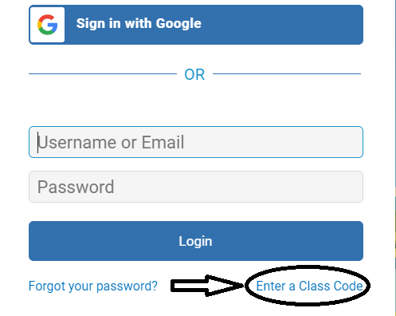

# GSG Code Academy Application: Technical Tasks

In order to be considered for the in person technical interview, **you must complete the following Coding and Typing tasks**. We will consider the completion and quality of ALL of these tasks when we make decisions on who to invite for the in-person interview.

The coding section is by far the longest section and will require the most time to complete.

**It will take time to complete these lessons.** We suggest having a consistent schedule over a few weeks to complete these lessons. If you ever get stuck or feel overwhelmed, ask for help on the [Discord Server](https://discord.gg/TjzYPC6FfC), or drop by one of our campuses in person. We are very happy to help.

## Typing:

Typing is very important skill in life and especially in coding. If you are a good typist you will find learning to code much, much easier.

Join the GSG classroom on TypingClub, using **the same email address you used in you GSG Code Academy application**. If you do not use the same email address we will not know your score.

**[Click here to join the classroom.](https://gsg-code-academy.typingclub.com/signup/GMUR84A)**

**if the link above is not working then follow these steps:**

1- [First click this link to join the class](https://gsg-code-academy.typingclub.com/signup)

2- Click `Enter a Class Code`

3- Copy and paste this code `GMUR84A` then click Sign up after that you can fill in your information

By the application deadline, you must **complete at least the first 50 lessons in Typing Club**.

Each lesson should take less than 10 minutes to complete. The best way to improve your typing is to do a small amount, practising every day, rather than doing all of the lessons at once.

## Coding:

Complete the following lessons, which are an introduction to Front End Web Development. **You should make sure you take the time to read and fully understand the concepts, and not just rush through to complete the challenges**.

The lessons have been carefully curated from amazing, open-source teaching resources - most notably [Odin Project](https://www.theodinproject.com/).

We have intentionally organized the orders of the steps in a way to structure your learning. We highly recommend that you follow the steps in the order they are listed.

In the in-person technical interview you will be asked questions to check your knowledge and skills in these topics. **You will be tested on your general understanding of concepts, specific coding questions, and your understanding of your project code.** The best way to prepare for the in-person technical interview is by **completing these lessons thoroughly and honestly (i.e. no copying and pasting from Google!)**

**Let's get started!:**

0. [Installing a text editor](pre-requisites/00-installations.md)
1. [Introduction](pre-requisites/01-introduction.md)
1. [HTML & CSS](pre-requisites/02-html-css.md)
1. [Developer Tools pt 1](pre-requisites/03-dev-tools.md)
1. [HTML Project](pre-requisites/04-project.md)
1. [Javascript 1](pre-requisites/05-javascript-1.md)
1. [Javascript 2](pre-requisites/06-javascript-2.md)
1. [Developer Tools pt 2](pre-requisites/07-dev-tools-2.md)
1. [Javascript 3](pre-requisites/08-javascript-3.md)
1. [DOM Manipulation](pre-requisites/09-dom-manipulation.md)
1. [Clean Code](pre-requisites/10-clean-code.md)
1. [Javascript Project](pre-requisites/11-project-js.md)
1. After completing both the HTML and the JS project, you must fill out this form: [**PROJECT FORM**](https://airtable.com/shrDsyTLInSnd5t6t)
1. After completing the lessons, you must solidify your learning by [reaching 5kyu in JavaScript on CodeWars](https://www.codewars.com), and making sure you continue your FreeCodeCamp learning until you get 200 points (after doing the sections mentioned lessons 1-11).

### Summary of most important tasks:

We will make decisions on who to invite for the technical interview, based on satisfactory completion of the tasks and projects from steps 0-12. By completing all of the technical tasks, you will have achieved:

- [x] 2 Projects:
  - [x] [HTML & CSS Project](pre-requisites/04-project.md)
  - [x] [A Javascript project, which will have been assigned to you over email](pre-requisites/projects/)
  - [x] When you have finished both projects, you MUST fill out [this form](https://airtable.com/shrDsyTLInSnd5t6t) to submit them. If you don't fill out this form your application will be unsuccessful.
- [x] 200 points on FreeCodeCamp (the exact topics you need to cover are stated within lessons 1-12)
- HTML and CSS
  - [Basic HTML and HTML5](https://learn.freecodecamp.org/responsive-web-design/basic-html-and-html5/)
  - [Basic CSS](https://learn.freecodecamp.org/responsive-web-design/basic-css/)
  - [Responsive Web Design Principles](https://learn.freecodecamp.org/responsive-web-design/responsive-web-design-principles/)
  - [CSS Flexbox](https://learn.freecodecamp.org/responsive-web-design/css-flexbox/)
- [Free Code Camp Javascript Basics](https://learn.freecodecamp.org/javascript-algorithms-and-data-structures/basic-javascript/)
- [x] Level 5 kyu on [CodeWars](https://www.codewars.com) in JavaScript.

If you get invited to a technical interview, your understanding of the concepts learnt will be tested so it is not in your benefit to copy and paste in order to acheive these goals. **To pass the technical interview you will need a solid understanding of the concepts learnt throughout the lessons.**
